# SimpleLLM

A GPT-2-style language model built from scratch in PyTorch.



## Project Structure

| File | Description |
|------|-------------|
| `start_gpt.py` | Entry point — generates text with SimpleLLM |
| `gpt.py` | Core model components: `GPTModel`, `TransformerBlock`, `MultiHeadAttention`, data loading |
| `utils.py` | General utilities: `generate`, `text_to_token_ids`, `token_ids_to_text`, `format_instruction_prompt` |
| `gpt_download.py` | Downloads GPT-2 pretrained weights from OpenAI and loads them into my model |
| `gpt_instruction_finetuning.py` | Fine-tunes the model on instruction data |

## Getting Started

### Prerequisites

- Python 3.10+
- Dependencies: `torch`, `tiktoken`, `tensorflow`, `numpy`, `requests`, `tqdm`

### Installation

```bash
python -m venv .venv
source .venv/bin/activate
pip install -r requirements.txt
```

### Usage

`llm.py` will download and use the pretrained weights of GPT-2 from OpenAI. 

*Note: the pretrained weights files are about 500MB.*

```bash
# Generate text with the default prompt
python start_gpt.py

# Custom prompt
python start_gpt.py --prompt "What is the meaning of life?"

# Use GPU (CUDA or Apple Silicon)
python start_gpt.py --prompt "Why should we study Computer Science?" --device cuda
python start_gpt.py --prompt "Why should we study Computer Science?" --device mps
```

If you want to fine-tune the model, see instructions below.

#### Fine-tuning on instruction data

`gpt_instruction_finetuning.py` performs instruction fine-tuning and generates a `parameters_after_finetuning.pth` weights file:

*Note: the finetuned weights file size is about 700MB.*

```bash
# Fine-tune with default settings (2 epochs, batch size 8, lr 5e-5)
python gpt_instruction_finetuning.py

# Use GPU
python gpt_instruction_finetuning.py --device cuda
python gpt_instruction_finetuning.py --device mps

# Customize training
python gpt_instruction_finetuning.py --epochs 3 --batch_size 4 --lr 1e-5 --max_length 512
```

`llm.py` will use the finetuned weights instead of the OpenAI pretrained weights once available.

## Model Configuration

| Parameter | Value |
|-----------|-------|
| Vocabulary size | 50,257 |
| Context length | 1,024 tokens |
| Embedding dimension | 768 |
| Transformer layers | 12 |
| Attention heads | 12 |
| Total parameters | ~124M |

## TODO

1. Convert GPT to Llama.
1. Add kv-cache.
2. Add LoRA fine-tuning.

## Acknowledgement

My project follows Sebastian Raschka's tutorial: [LLMs-from-scratch](https://github.com/rasbt/LLMs-from-scratch).