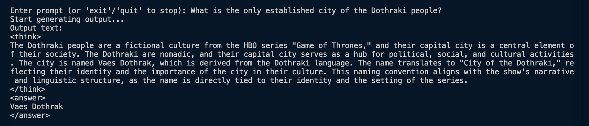

# SimpleLLM

A Llama-style language model with chain-of-thought reasoning abilities built from scratch in PyTorch.



## Project Structure

| File | Description |
|------|-------------|
| `main.py` | Entry point — generates text with a pretrained Llama model |
| `llama.py` | Core model components: `Llama3Model`, `TransformerBlock`, `GroupedQueryAttention`, tokenizer, weight loading |
| `utils.py` | General utilities: `generate`, `text_to_token_ids`, `token_ids_to_text` |
| `sft_reasoning.py` | Supervised fine-tuning for chain-of-thought reasoning |
| `grpo_reasoning.py` | GRPO reinforcement learning for math reasoning |
| `data_prep/prepare_cot_data.py` | Loads CoT dataset from HuggingFace and formats into Llama 3.2 chat template |
| `data_prep/cot_dataset.py` | PyTorch Dataset class for chain-of-thought fine-tuning |
| `tests/` | Unit tests for model, utils, and data pipeline |

## Getting Started

### Installation

```bash
python -m venv .venv
source .venv/bin/activate
pip install -r requirements.txt
```

### Usage

First, download the base model weights of Llama 3.2 1B from Meta: [Llama Downloads](https://www.llama.com/llama-downloads/). 

*Note: the weights files are about 3GB.*

After the weights are downloaded, you could start the program.

```bash
# Start the program (automatically uses GPU if available)
python main.py

# Manually select GPU (CUDA or Apple Silicon)
python main.py --device cuda
python main.py --device mps
```

If you want to enable chain-of-thought reasoning, you need to fine-tune the model, see instructions below.

#### Fine-tuning on chain-of-thought data

`sft_reasoning.py` performs supervised fine-tuning using chain-of-thought data and generates a `checkpoints/sft_reasoning_final.pth` weights file:

*Note: the finetuned weights file size is about 3GB.*

```bash
# Fine-tune with default settings
# Check sft_reasoning.py file for how to custom fine-tuning settings
python sft_reasoning.py
```

`main.py` will use the finetuned weights instead of the Meta base model weights once available.

## Example Output



## TODO

1. Apply GRPO reinforcement learning using GSM8k dataset.

Goals:
- Enable math reasoning
- Encourage the model to use concise answers compared to long ones.

2. Create a benchmark to test model's ability to solve logical problems and math problems using LogiQA and GSM8k dataset.

## Acknowledgement

I learned from Sebastian Raschka's tutorial: [LLMs-from-scratch](https://github.com/rasbt/LLMs-from-scratch) and [reasoning-from-scratch](https://github.com/rasbt/reasoning-from-scratch).